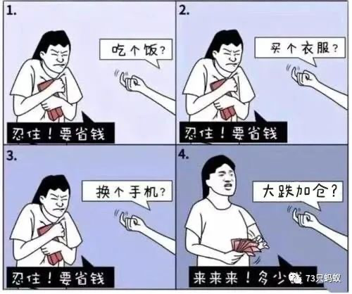

1. 记录

流水：
1。 周一：联调成功。明天继续。
今天回来， 嘉欣在鼓捣一个汤， 一边放着在线课程。 从十一点搞到12点， 我觉得好浪费时间。 但要抑制住自己教导别人的冲动， 这很恶心， 本来我们的时间也没有必要那么有"意义"。
我收拾了我的书柜， 把嘉欣那一层给她了。其他的层的老不看的， 不喜欢的收起来了。再买一点吧。

2。 周二：代码优化了一下log什么的。
昨天晚上和今天晚上给大姑大姨买了一点年货, 本来不想买什么了, 因为实在想不出来. 昨天想买点腊肠腊肉什么的. 多了也买不太起, 就一家买了两斤腊肉两斤腊肠, 没敢买不好的, 对比了很久的价格才买.

这个图很像我, 我他妈好自责.

现在心情不好, 几个原因:

1. 我买的基金又跌了. 之前一直不好, 现在大概赔了一万五, 前两天涨了一些, 这两天又很不好. 

   看到上面那张图, 我在反思自己的“操作”, 还能不能定投. 我在反思自己, 真到自己的钱了, 每个人都会亢奋.

   我要不要停止继续把钱放在一个篮子里?

2. 今天给嘉欣买了一个红色的内衣内裤, 138元, 因为明天是我们在一起1314天, 而且今年是她本命年.

   但我有点抠索过头了, 上次自己买衣服还是夏天打完蟑螂后, 买了一件处理的羽绒服, 128元. 我在想自己是不是舔狗.

   同时, 嘉欣最近也比较穷了, 我本来想和她一起”共度难关“帮帮她, 但是前天她父母多给她一千块, 第二天买了一件260的毛衣. 我觉得我的试图都白费了. 昨天还就这个事情责怪了她. 我这种控制欲太强了, 看着别人的消费习惯太浪费, “不懂得节省”, 就气的不行. 也不想“一起努力”了, 这也是我的可笑之处.

3. 我的钱不太够了, 上面两个原因, 加上不知道为什么买了一点什么东西, 总觉得生活费不太够, 这个月已经花了3700.

4. 我太纠结于小事, 被小事情缠住.

   今天我把14,8元的下水道疏通剂推掉了, 因为斤斤计较.

### 周六

昨天晚上也吵架了

后记: 

最后上班的这一周还挺爽的, 后面几天就是玩, 上班划水. 

我忘记做的什么了, 很爽. 记忆从我的脑子里划走了

