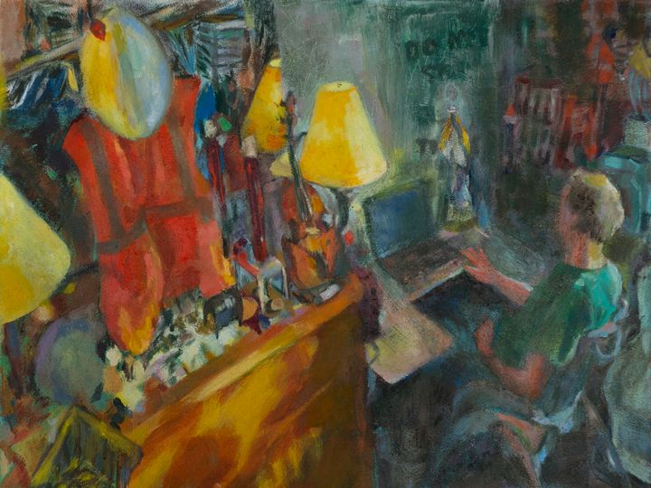
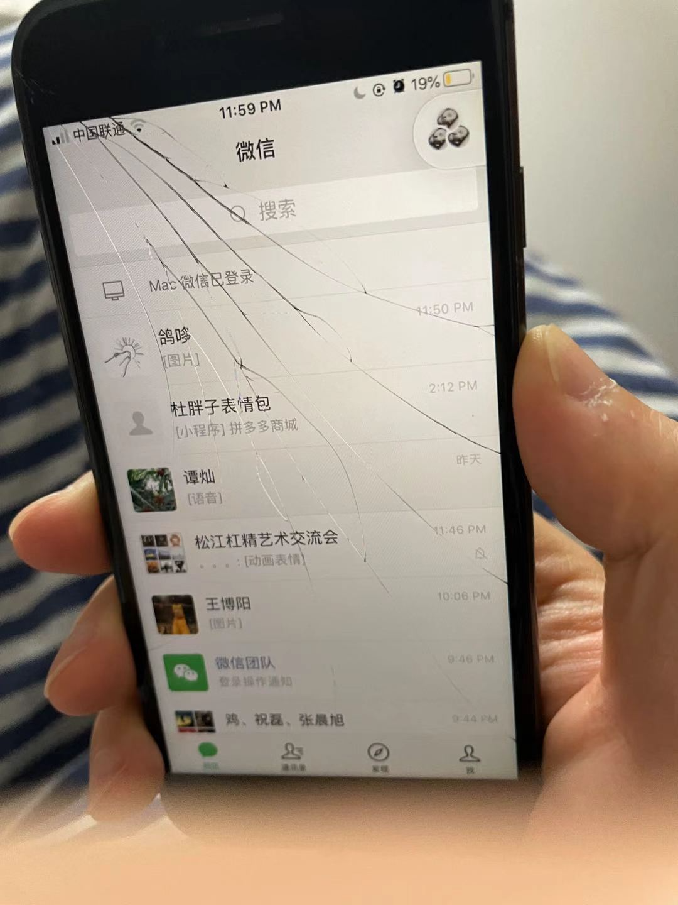

这周是居家办公的第二周了.

本来以为只用居家办公一周, 结果还要"放假"一周. 在家办公的精神很懒散, 根本没有产出, 再加上这周在换组, 所以几乎完全没有干活.

我明白了一个道理, 一朝天子一朝臣, 旧Leader的遗产是否被抛弃, 完全依赖新Leader的"喜好". 正好我读的<邓小平时代>里面也有相同的感受.

这周另一个深刻的感受是疫情相关的, 我变得更讨厌这个环境了, 每个人都想要掌管别人的生活.

可能是因为本周前几天, 我和嘉欣的性生活比较和谐, 我们吵架比上周少了一些.

**工作日:**

周一, 上午来了一个新同学. 我把他拉到非常尴尬的组群里(新旧两套4个leader都在, 没人说话), 欢迎新同学. 

新的大Leader说这周和每个同学都聊聊. 中午十二点我就接到了电话. 问了自己最近怎么想的, 想干什么. 然后我们现在在做的活动平台, 新leader说有点偏业务, 不太合适. 

我明白现在在做的活动平台要中途放弃了.

周一傍晚读完了<邓小平时代>, 看完一本书确实有一点感受, 但这种感受又很难描述出来, 可能积累多了就能描述了吧. 主任说看了10年7000小时, 要有300+本. 我熬熬继续看下去.

开始读<巴菲特之道>, 才发现原来自己之前买的这本书不是自己想看的, 我买的全名是<巴菲特之道-巴菲特的投资思想方法实录>, 哈哈哈哈哈哈哈, 我被骗了. 

周二白天正常的熟悉各业务, 然后傍晚和嘉欣分开做饭, 感觉只有这样才能减少分歧, 如果想要不争吵的情况下做饭, 只有两种可能, 要么分开, 要么当天下午中奖

小区还在封禁, 我不知道为什么, 我经常从后门跳出去. 很感谢嘉欣最初给的我跳出去的示范和鼓励, 我越来越顺手. 从前门很难很难混出去, 刚开始时候还可以假装在草丛那里散步, 然后顺着草丛的路溜到大主路上去.  但是今天比较松了, 我顺利的出去了.

今天和之前不同, 所有的店都关门了, 菜店在偷偷摸摸开门, 八点就已经黑了, 妈的回到宵禁的年代了. 当天我不知道, 从那天到今天, 这附近的店家管理越来越严格, 真是CTM了.

周三, 昨天leader说今天下午三点聊聊天, 上午抓紧看了部门的介绍文档, 聊了十几分钟, 然后就把我们几个新人拉到群里了, 发现我们原来的组被拆散了, 之前的项目更不可能做了.

拉进组自我介绍, 只有我和另一个好朋友介绍了一下, 然后别人什么反应也没有. 我们很尴尬, 于是我就出去逛了逛, 买了点菜. 

商店都关门了, 只在小区门口的商店买了点青菜. 这些天我认识到青菜的重要性, 不吃青菜真的会很难下咽, 然后还上了火. 虽然上火主要和个人洗漱的卫生有关系, 但是上火的时候没有绿叶菜确实感觉不好吃. 青菜好贵, 12元一斤.

商业是最大的福报，即使在这样的一个变态的环境下，菜店老板们还是想方设法给我们带来了菜.

看巴菲特之道, 里面要求很高的利润, 还有本分, 不要多干事情. 比如: “他要求可口可乐拥有的任何生意都必须优化其资产回报。” 我觉得我以后不能随便买基金了, 看好了再说, 先把钱省下来, 不要动. 那些不能动的钱, 唉, 不知道要不要割肉.

周四是很平淡的一天, 但是晚上我的手机屏幕被摔碎了, 这一天我会永远记住的. TMD! 我好心疼!!!!!!!.

周五看完了<巴菲特之道>, 感觉我以后要再看一遍, 要多看书, 要有耐心, 巴菲特都九十了, 我还有N年要走, 不要被30岁焦虑逼着走, 慢慢来, 四十岁再说吗, 先看1000本书.

我操疫情和疫情相关的所有人TMD. 

下午开会直接过问我们新的项目的内容了, 之前的完全抛弃了. 我明白了一个人一旦失去”权力”, 他的遗产会马上灰飞烟灭.

晚上开始看<活出生命的意义>

**周末**

周五晚上和嘉欣因为整洁吵了一架, 我觉得她的东西乱放, 地板上到处都是, 她说就是需要这样的地方, 我还抱怨她不干家务. 吵完后我很内疚.

昨天上午十一点完全起来的, 然后准备了点吃的. 中午就骑电动车出去遛弯了. 

印象比较深的是宝山一个菜市场, 里面一个卖粮的阿姨很热心,"小伙子, 到阿姨这里买不会贵的!", 我就买了一斤面粉. 感觉宝山好大啊. 一路上好多工厂, 工业区, 这就是人为规划的"好处"啊, 社会主义的人永远不会明白世界上会有一种叫自由的东西.

晚上用面粉做了一个"咸食", 面糊在平底锅里煎成饼, 我的锅地面比较平, 也算是平底锅了. 很好吃, 和小时候我娘做的几乎一样好吃. 

今天早上起得也不早, 唉. 中午煮了昨天下午回来时候买的思念水饺, 感觉很好吃! 又便宜又好吃. 

下午在房间里晒太阳, 准备2点钟出去逛一圈, 现在已经2点零6分了. 

**读书的意义**

我觉得读书的意义在于思考，带入，推理。而不是最后的几条道理，读书的过程是一种思维锻炼，像运动员的晨练一样。它不会留下确定的意义，甚至没有确定的收获，但它是强大思维的营养来源。

