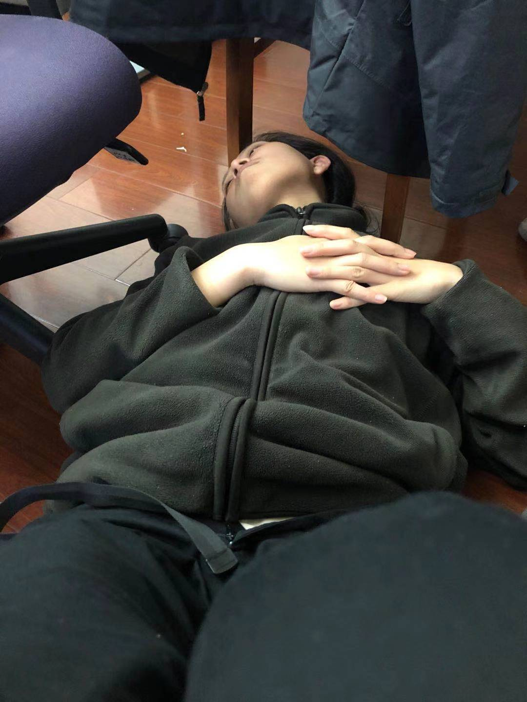
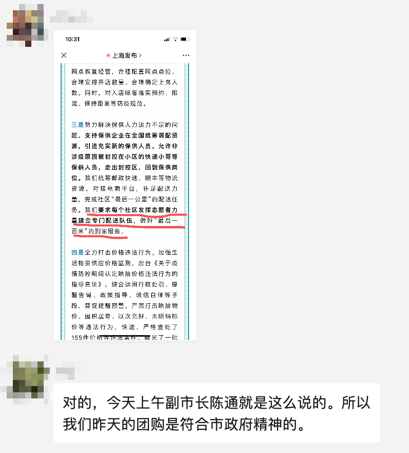
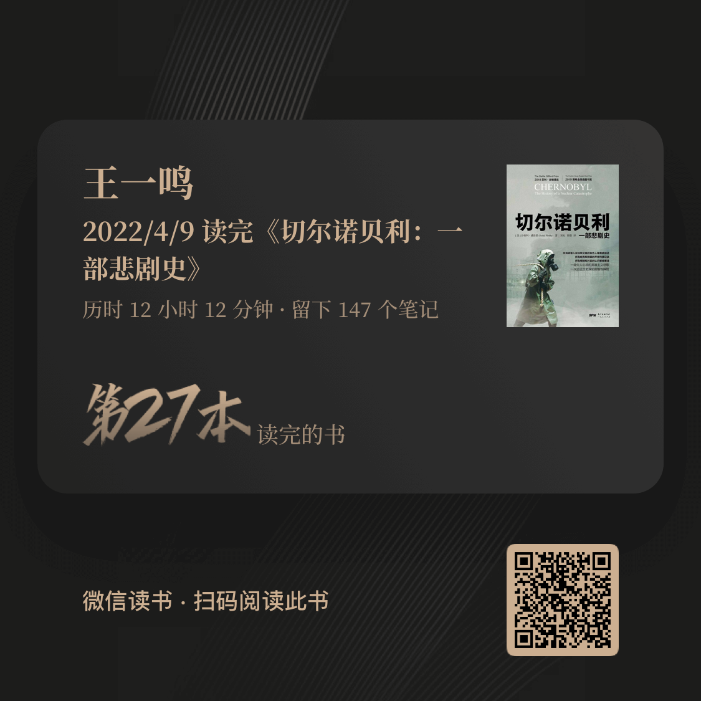
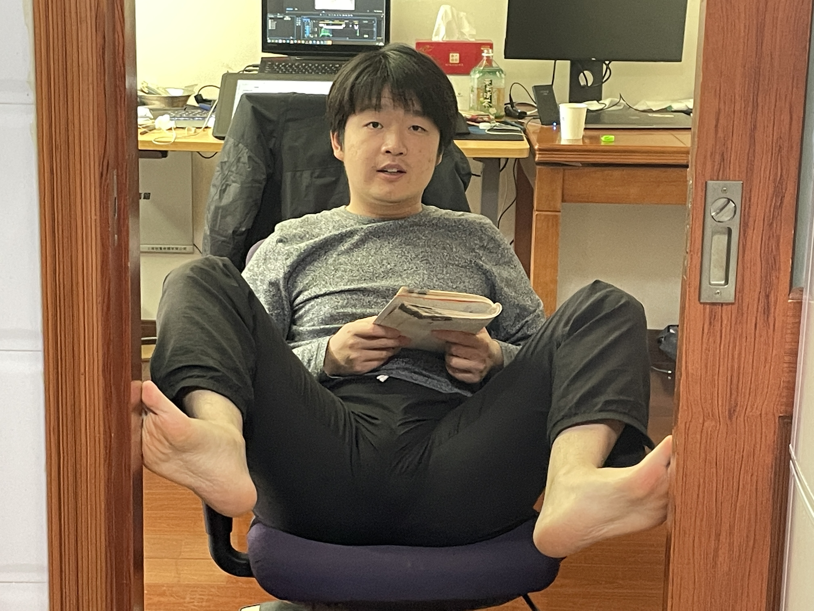

> 和上周一样, 稍微平复了一些, 还是想操他妈. 看完了两本书, <切尔诺贝利>, <影响力>. 后面这本书好看, 看着上瘾.
>
> 不知道哪个狗逼在这场白蚁灾里造的物资这个词, 我操他妈.
>
> 我还是一直在想<活出生命的意义>这本书, 后半部分不太好读, 但作者的经历和几句"鸡汤"一直在我脑子里. "人始终都有如何面对生活的自由". 

**工作日**

因为上周是清明节, 所以第一天是周三, 这种工作三天放假两天, 感觉自然是很舒服.

周一我一个想法, 现在的灾难是不是因为民族太统一了? 仿佛每个人都share the same interest, 不能也不敢争.

周三早上就开周会, 工作还可以吧, 忘记了. 

昨天嘉欣联系了小区超市老板想买带盐, 说今天十点在超市后面连着的快递点门口接头. 早上嘉欣去完回来带着我最爱喝的绿茶两瓶, 可乐一瓶, 猪肉铺一包, 辣条两包, 盐一包. 很开心. 嘉欣太厉害了.

晚上准备出小区看看, 十一点出去的, 十二点之前溜回来了. 在外面溜达很担心, 不是病毒, 是白卫兵, 还有两个闲着没事的在赶我回去, 我也很怂地骗他们往回走.

墙外即使什么都没有，也比里面舒服. 这道栏还算好爬吧, 难度75分.

在外面路过一个卫生所什么的白卫兵集中地, 门口放着两袋子脱下来的防护服, 我拿了一个, 觉得以后可以伪装一下. 回来后就因为这个和嘉欣吵架了. 其实也不是因为这个, 因为刚开始时候嘉欣还说怎么没拿两个(以防她也需要伪装一下). 然后嘉欣因为对被隔离的恐惧和我吵架了, 从十二点前, 一直吵到十二点五十累倒在地.

这次吵架完美错过了我们相遇四周年的纪念日, 18年4月6日晚上11点多我们见面认识的, 然后回宿舍在微信聊天到一点. 哈哈哈, 真是划过去了.

周四还活着是符合种秧精神的. 上海不愧是国企城市.

下午工作的时候, 恍然发现当时的场景好熟悉, 仿佛N年前梦到过. 我在设计sql表, 新公司, 新项目. 嘉欣在屋子里睡觉. 下午, 阳光打进来, 热风却不太闷.

当天比较开心的事! 这周比较开心的事! 嘉欣晚上开完会进来说自己其实通过了高布兰的作品投递, 之前是因为中介机构的信息搞错了, 有两个考号, 却只提供了一个. 我之前想过这次能不能反转, 我以为反转会是因为嘉欣后面邮件争取了很多次, 然后人家再给个集会, 没想到是这样的由头. 虽然很无厘头, 可这个无厘头的理由却仿佛更有说服力一点.

过了一会非要拉着我去楼顶逛了一圈. 

周五平淡无奇的工作, 设计完sql表核对一下就可以开发了. 

因为昨天嘉欣接到的消息太突然了, 今天下午就要面试了. 所以昨天晚上和今天嘉欣紧急准备了两场面试, 一场是高布兰的, 另一个是之前高布兰落选后的备选学校. 面试完后嘉欣的自我感觉良好, 但我感觉人家总共不会在中国录取超过4个人, 面试的有二十多个, 可能性不太高, 不要抱太大希望吧. 祝好运.

其实这有一点滑稽, 这些天我们一直在想要如何更改之前的方案, 现在仿佛之前的方案又有可能行得通了, 蛮好. 希望嘉欣可以去自己喜欢的学校留学, 然后毕业后把我带过去, this is my plain.

还有一点滑稽, 本来的期望是没有面试机会, 然后这次又有了, 而且面试后嘉欣的信心很大, 我仿佛在家里的地位相对稍微有一点下降(30%), 说话也不敢太大声了, 甚至在嘉欣表示"我爱你"的时候有点逃避, 我值得爱么? 这种心理是向我展示了一点那些做成功人士丈夫的烦恼么?

人真的可以在任何境遇中活下去, 不管之前的期望和现在的落差多大, 过一会就适应了.

晚上嘉欣面完试说自己很累, 我还好.

**周末**

周六本来准备早上五点钟起床, 其实五点钟醒来了, 但觉得出去也要背负被抓的风险. 就睡了. 不过也许只是个借口, 最后我是十点多醒来的.

十一点多才起来, 准备午饭时候和嘉欣因为我昨天没有把剩菜放入冰箱和带鱼放入冰箱和木耳提前发泡而吵架. 吵得很凶. 我在怀疑我的生活. 我不想要以后婚姻生活是这样的交往模式. 下午和嘉欣聊了这个事情, 也没聊出什么结果, 可能我这辈子做不了成功女人的老公?

下午1点48开始洗澡, 把自己的办公桌(餐桌)上面的塑料桌布掀掉, 太沾手了. 

下午缠着嘉欣再给之前的小区超市老板打个电话想买点东西, 本来周五就想买的, 很巧的是超市正好进了一点货, 我们就抓紧过去了, 买到了很多东西, 还有我爱喝的绿茶饮料, 又是很开心. 

看着路上送"物资"的白卫兵煞有其事的作态, 只想骂一句操他妈. 

晚上终于看完了*切尔诺贝利*, 上周末开始看的, 其实不太好读, 一个是苏联人名字记不住, 一个是描写的本来也不算特别好读. 感觉还行吧, 不是特别吸引自己, 描写的有些难受, 也有些同感. 然后看中午就选好了的<影响力>, 之前买的二手书, 一直放在自己床头. 

*影响力*这本书太好看了! 简单直接的道理, 大量的案例, 很有意思, 很好读. 读起来让人上瘾, 最后我看到了凌晨两点半. 

书开头的10道测试题我只对了4道, 差点变成弱智人群, 嘉欣倒是做对了5道, 这是说明我一直以来的自信其实是傻逼们固有的臭毛病么? 我还是不太想承认.

今天早上十点多醒来, 看了一会, 下午竟然和嘉欣抢了起来. 大概傍晚六点看完的, 真的不错!

中午发现公司给上海和吉林的同事每个人发1500块钱(虽然需要扣税20%), 还是公司好. zf这种他妈刺你一刀然后给你个馒头的, 真是狗比. 

下午嘉欣看的时候, 我还看了大学时候买的一本书<户口本>, 作者讲了自己小时候发生的事情, 一篇篇的散文, 操蛋的青春. 发现看纸书也不是那么没意思.

这两天看这本书让我更坚定一个对我有帮助的点, 要把书撕成几部分来读. 手里捧着一本厚书真的读不下去, 撕成一章一章的看起来更投入更快了. 

这些天读书其实没有什么功利性了, 可能是功利性的技术书有点读不下去. 随便看看吧. 现在感觉可以预估自己看书的时间了, 像是影响力这种非常好读有意思的书, 20万字大概读7-8个小时, *切尔诺贝利*虽然也是大概20万字, 但不是特别好读, 包括走思的时间大概12个小时吧.

今天晚上提醒嘉欣给外公打电话, 嘉欣外公耳朵不好, 打电话的时候一直在说喂? 喂? 喂? 嘉欣大声说了几句听得见哇? 然后声音就渐渐不耐烦了, 最后就生气的挂掉. 这种电话我见了好多, 但觉得今天本来是祝外公生日快乐, 我觉得可以耐心一点, 然后嘉欣说我没有进入到那个状态不明白不懂就不要下评论. 

**账单**

这周没有这个月刚开始那种还债的钱了, 总共花了513元.

主要都是在买所谓的物资, 280块左右. 一大根红肠65, 还没到的一些蔬菜60, 一瓶牛奶22, 周六在超市里买了些米, 水饺云吞蘑菇手抓饼饮料什么的花了134块. 

虽然不能发货, 还是网购了一点东西大概70, 洗面奶28, 袜子22, 还有一点辣椒6.

 交电费134. 本来嘉欣是说交电费, 但前两天嘉欣买了很多菜, 不太好意思让她付了.

买了两本书只有26哈哈哈. 在微信读书上看到新上架的托马斯索维尔的<财富贫穷与政治>, 就在网上买了本实体书19, 也许能看下去呢. 另一本是图便宜买的拼多多百亿补贴的<纽约>, 其实我不知道是写的什么, 6块7的价格让我实在是想买.

**比较开心的照片**

1. *自由*:

2. *生气😠*

   

3. *绿茶*

   

4. *好吃的晚饭*

   

   

   

   

5. *远眺富人区*

   

6. 超市购物

   

   

7. *越来越胖的我*

   