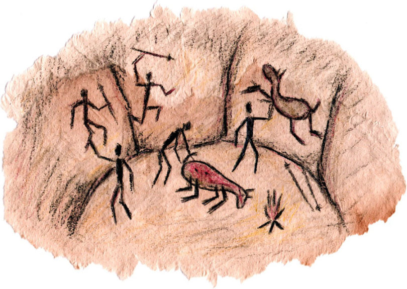

## 17-18周周记

因为上周日调休, 周六没调整过来, 所以上周没记录. 

这两周很快, 这些日子都很快. 我有点不太想记录周围的环境了, 就是很糟糕, 这几周已经被驯养习惯了, 这种驯养让我做了一回上世纪30年代的德国人, 大家在当下显露出来自己的面目: 气愤的人, 不知所措的人, 无助的人, 帮助别人的人, 跳起来的人, 无感默许的人, 支持的人, 互相指责的人... . 不知道我德意志的身份还要多久, 还要几次. 

对了, 我是气愤&逃避的人, 有点像很流行的性格测试, 嘉欣和朋友经常在聊, 还要求我去测试, 甚至是一个相亲软件上面都会展示性格测试的标签. 很久之前嘉欣给我测了一次, 说是JEIT之类的, 前段时间又要测, 感觉和我们做的服务健康监控一样, 要看看我这个人是不是变了. 不知道这些人是怎么想的, 性格当然很重要, 但是通过问题测试出来的性格不重要, 回答对自己的问题的时候, 人会撒谎. 最重要的是人不是机器, 不同上下文的人是不一样的. 感觉这些喜欢性格测试的人都是communist, 至少也是一个凯恩斯信徒.

另外的是这两周和嘉欣的吵架, 已经麻木了, 很小的事情就会吵起来, 次数频繁, 程度激烈. 

**17周**

周一工作应该没做什么, 主要是在等下午老板的谈话, 谈之前很忐忑, 这是第一次见老板, 聊得就还行吧, 也符合预期, 正常的绩效, 还有对应时间的年终奖. 谈完心里的石头落下了, 在这种狗逼流窜人间作案的时候, 庆幸自己还能作为一个还算合格的工作者, 被越来越受限的资本主义协作体系所接纳. 

周二听了一个讲切尔诺贝利的博客, 下面有个留言很傻逼. 唉, 不提也罢. 

周二在等嘉欣的面试成绩出来, 其实我不太抱希望, 感觉面试的录取率在1/5左右. 大概傍晚八九点的时候, 中介说考上了, 给了一张名单截图, 说学校还没正式公布. 自然是很开心. 之前的计划都实现了, 虽然有点险. 之后的计划是不是能实现呢? 我不抱太大希望, 因为我喜欢做一个大概率可达到的计划, 去做, 告诉自己不期待实现, 等待结果出来后, 享受这种大概率的开心. 

初中时候我就注意到自己的这个习惯了, 每次考试之前我不太会复习, 不关注, 降低期望, 结果大概率还符合自己的预期. 考得最好的是初二一次, 考完试后(应该是过了一两天)我们在操场上完, 班主任路过我们, 挺开心的和我说考得不错. 那次我考了班里面第三名, 后来一直到大学毕业, 再也没考过班级第三了. 不过这也无所谓, 这是我大三的时候想通的道理, 不用太注重成绩. 我一直不是最优秀的那个, 但我一直都挺开心的.

周三没有记录, 我也忘了那天做什么了, 它从我生命里溜走了.

周四工作忘记了, 晚上沉浸在现在和之前政治局势里面, 就是在YouTube上面看些解密视频. 按我逃避的心态来说自然是很无趣, 但我的雄性基因中猎奇, 霸道, 争斗的那部分代码被激起来了, 看到晚上快两点.

发现了一个很有意思的节目, 名字叫`书斋夜话`, 博主大概七十岁, 之前也在过体制内, 90年代去美国的. 他分析的真好, 尤其是对最近的人祸分析, 让我想起在雪球看到的一个评论, 大概意思是这次封控, 让他佩服的是一些体制内老人的经验(看似无来源预感), 尤其是参加过温格的.

已经快五十年了, 现在看来这个游戏规则还在继续, 不想跟着玩了. 嘉欣这次出去仿佛又给我开了一个门槛稍微低些的通道.

周五的工作没记录, 应该也没干什么的. 又听了一些<书斋夜话>, 里面讲08地震之后xx的威信就下降了, 人们不相信了. 我在想是么? 应该是吧, 即使是疫情, 我们总不能因为被管制而增强感激. 理性乐观派, 我最近沉浸在悲伤里了.

周六我忘记做什么了, 晚上看了新蝙蝠侠, 三个小时, 我不太喜欢, 没什么高潮, 镜头都很黑. 

晚上想发个朋友圈, 想删除几个不熟不想被看到的微信联系人, 想了很久删或者不删, 然后我仔细分析自己"舍不得"删除的三个原因: 这个人可能对我有用, 对人家有性幻想, 展示欲.

又想, 我没有多少个联系人, 也没有人脉, 我认识的人大概是嘉欣的1/4吧. 一方面我觉得现在的状态挺舒服的, 另一方面, 因为看一些人说自己的经历, 总有一些好友帮忙/创业, 我觉得自己没有什么好友互相帮忙/创业.

周日好像是读书日, 我忘了自己干什么了. 

有个感觉是读书和读书不一样, 每个人的观念虽然和读书有关系, 但真的很看缘分. 因为看到公司一个读书日的推文下, 评论说"强推*辩证唯物主义和历史唯物主义*, *马克思主义基本原理*". 想明白有个好缘分之后我也不怕了, 以后有机会也看看.

**账单:** 425块

生活必需品花了197块钱, 超市买了点零食和菜23+37, 买了一只盐焗鸡60, 团购买了面包33, 牛奶22, 京东买了一小壶油22.

买书花了154块钱. 邓小平时代49, 少有人走的路16, 简单的逻辑学14, 罗斯巴德的钱为什么变薄了(英文名叫政府做了什么)14, 小岛经济学16, 美国种族简史16, 万历十五年7, 美丽新世界12, 蔡志忠漫画菜根谭12.

嘉欣录取那天在老娘的群里和初中同学群里发了几个红包, 花了57块钱(本来是80, 有人没抢).

之前忘记取消美团单车会员了, 扣了16块钱.

**18周**

周一傍晚做了一个雅思听力测试, 因为之前加入了一个刚去加拿大的英语赖老师的学英语群, 推荐我们摸底试试. 没什么准备只得了5分, 也算还行吧, 毕竟什么准备都没有, 希望明年暑假可以考一次雅思.

晚上看了半天的<米塞斯大传>, 没看太明白. 我很自卑, 经济学的书看不懂, 计算机的只是看不懂, 可能我注定是个三脚猫.

周二记了一句"明朝的尚方宝剑斩不了清朝的官", 我不知道什么意思了已经.

晚上看<奥派经济学的大师们>, 看的又很无力, 里面很多名次不太懂, 只能粗略的看一些大师们的经历.

周三上午轮到自己主持周会了, 有一丢丢紧张, 其实本来不是我, 昨天leader催我提醒一下大家填写, 那我不能反驳说没轮到我, 应该是xxx. 在家这些天, 在这样一个动荡的年代里, 很感谢公司.

周四早上醒来想起做了一个挺有意思的梦, 很长时间没做梦了, 想起之前做梦, 早上记起来都很有趣, 像是真的一样. 梦里面我和几个人去找到了一个空院子, 我们就住进去了, 然后后面还演电影什么的, 忘记了.

学go.dev, 发现go相比java真的是简单, 简单到愿意用vscode这个陌生的IDE, 而不是Goland, goland好多命令和文件的管理感觉不太方便(实际上没问题), vscode可以ssh devbox随便搞linux, goland没有. 

傍晚上线, 明白了上线流程后和之前的同事猛哥感慨了一下这边的效率很高, 工具都很好用.

看了一个军体拳教练发的视频, 一个50多岁的农村女人, 自拍对着镜头哭泣, 感恩政府给自己发了牙膏, 酱油, 卫生纸之类的. 我感觉好丢人, 人怎么会变成这样? 

我没有把这个女人看成长辈而是和我类似的成年人(她不能算是很老), 我小时候觉得这个年纪的女人是我的长辈, 他们都有传统的美德或者是按照传统的规律做事. 我如果小时候看一个大人这样, 肯定说不上什么, 只会迷迷糊糊的遵从. 现在看就觉得, 你没有一点尊严么? 

我会想, 这个女人小时候也是一个小孩子, 如果看到父母做出很傻/无奈/献媚的举动的时候应该和我小时候一样吧? 

我并不是想骂这个女人, 很多人生长环境就是这样, 自己也会变成这样, 长在农村里的我太能理解了, 我想表达的是一种荒谬, 有些事情我们觉得长辈做得对, 自己慢慢变成长辈, 会对这种事情另有认知, 现在同龄人这样做, 有一种冲击感.

周五和嘉欣又因为做核酸吵起来了, 这些天真的一言难尽, 吵架已经不太想记下来了, 因为吵了很多次.

感慨生活确实越来越难了, 两个月前我还没做过核酸, 现在不做核酸变成了黄码, 这种民众筛查已经变成强制的了, 这在之前两年还都不敢想象, 只能是感慨身在德国, 越来越难.

下午发了工资和年终奖, 第一次有这么多钱月底发到银行卡里, 收到短信都很开心. 接着按照之前划分好的, 用了几分钟就把转去了应该在的位置哈哈哈. 

算了一下自己本月账单, 4月因为关在家里花费比较少, 总的应该只花了3000块. 今年平均月大概4000块(预算4000). 今年本来生活费预算是5000块, 最高不超过6000, 但是觉得还是应该克制一下, 还挺好的, 让我们感到开心/难忘的日子往往并不是最充裕的, 现在就很好.

看了一下去年, 本来是3000块的自己生活费, 但是是不够的, 因为这里面要包含饭费, 交通费, 水电费, 话费, 每月还助学贷款...所有的除了房租的花销. 所以我把每个月2000块钱的公积金也拿出来补贴了生活费, 所以去年每月预算在5000元, 我看大概的控制在了预算里. 这些钱做了很多事情, 和老娘出去玩了两天, 和嘉欣出去完了两次, 去天津玩了一趟. 真的是很幸福, 今年可能没有这么多机会了. 

算了一下工资, 想攒的钱, 等嘉欣出去后, 我要搬到公司附近, 每个月的预算应该会比现在少一点回到原来的3000块. 因为公司有食堂, 公司的饭还挺好的, 自己也可以解解馋, 生活水平肯定比去年自己吃好很多. 其余的就是想出去玩两次, 和老娘或者去见朋友, 大概6000应该也可以攒出来的. 加油! 生活越来越好.

晚上又和嘉欣因为洗澡吵了一架, 很有意思, 我本来不想洗澡, 看她去洗澡就问一下, 去洗澡了. 结果就被道德绑架, 你宁愿坐在这看电视都不愿意去洗澡. 从11点40吵到了12点10分, 我正在看的那一集毒枭都没看完.

当天看毒枭感悟：不要伤害合伙人的信任, 引申一下就是买基金不要把本钱亏掉(我不合格😂).

**五一前两天**

周六主要就在看毒枭, 之前看了第一季, 现在看第二季. 看的时候有很多疑问和感受, 比如后面毒枭一个人带着忠诚的司机离开了, 可为什么不通知其他的人呢? 正准备行动呢结果全被抓了, 一个人怎么东山再起呢?

查看了一下哥伦比亚的面积，感觉这片土地上有好多个组织，zf还有什么的势力。我以为和河北省差不多大，其实不是的，大概相当于六个河北省，大概是河北河南山西山东江苏安徽再加上浙江这么大。那我就明白为什么会有这么多的势力了，这真的太大了，这块地方几个省市包含了我这辈子的见识。

但有趣的是我想上面七个省，其实还不如新疆大，但是我会感觉这几个省要比新疆大个一两倍。因为新疆人口可能比河北省还少。究竟是人，还是面积影响了一个人的感觉？

最后两集看着让人可怜，为什么要搞成这个样子呢, 很蠢, 也很符合逻辑.

下午边看边蒸花卷, 自己和了一点面, 结果太软了, 面太沾手了, 最后弄出来的花卷也不太好.

周五下班前公司说通知每个人可以在每日优鲜上另一张食物兑换券, 一直没收到短信, 晚上下载了app, 发现已经发了, 发现有好多食物可以买, 就在每日优鲜上买了一点东西. 

周日和娘聊了一下连岳, 我对之前和娘推荐连岳的公众号感觉很不好意思, 现在连叔已经变成狗逼中的狗逼了. 

下午又看了一点<火线>, 感觉火线是自己看过最好看的两部美剧之一, 甚至可以说是最好看的. 看了开头两集,  还是那么吸引人.

下午和晚上看了一会<他改变了CN>, 大学时候跟风买的一本红皮书, 现在还没看完, 真是羞愧, 上学时候还没开窍, 现在也只是开了一点点.

晚上自己和面弄了一点馅饼, 还挺好吃的, 馅料是昨天晚上在每日优线上买的荠菜肉馅.

**账单:** 1339块钱

5月1号要还款了, 花销比较多. 电动车分期133, 给老娘买的电子书均摊到这个月140, 助学贷款192, 煤气费交了100块, 话费充了45块(优惠了5块钱), 上个月换手机均摊到这个月生活费400. 

生活必需品消费291. 超市买菜, 零食, 牛奶, 鸡蛋之类的109+20+32, 每日优鲜买了一些蛋花汤, 肉馅, 调味品, 可乐和美年达50+30+30+20.

买了两本书37块钱, 和动物交换身体16, 仿制药的真相21



